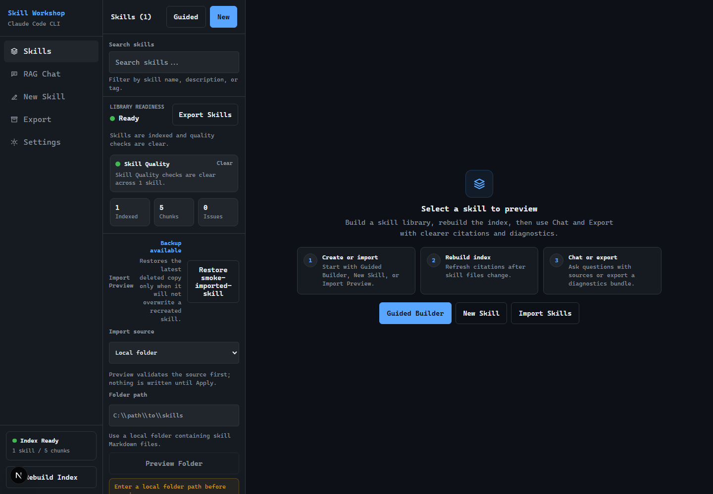
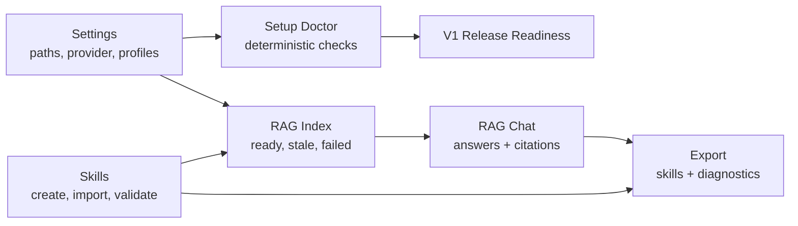

# Skill Workshop RAG

Claude-first local workbench for building, validating, indexing, chatting with, and exporting Claude Code skills.

V1 is intentionally local-first. It is designed for a developer running a private Claude skills workspace on their own machine, with deterministic readiness checks and sanitized diagnostics before anything is shared.



## What It Does

- Manage Claude Code skill Markdown files from a configured local workspace.
- Build a local TF-IDF RAG index over skills and ask grounded questions in Chat.
- Use Anthropic API mode by default, or optional localhost-only Claude Code CLI mode.
- Discover local Claude CLI/profile state without exposing account identifiers.
- Diagnose setup readiness through Settings, Setup Doctor, First Run Checklist, V1 Release Readiness, and Manual QA Evidence.
- Validate skill quality, import skill bundles safely, and export sanitized diagnostics.
- Keep device-local operations behind localhost guards.

## Product Shape



## Status

V1 is feature-complete for the Claude-focused local release path:

- Settings and runtime provider switching are implemented.
- Persistent index metadata and stale-state reporting are implemented.
- Skill lifecycle, templates, import preview, quality checks, delete/restore, and guided builder are implemented.
- Chat readiness, retry, citations, and streamed error handling are implemented.
- Claude Project inventory and sanitized diagnostics export are implemented.
- Release verification scripts, the manual external QA checklist, and Settings Manual QA Evidence tracking are documented.

Out of scope for V1:

- Hosted multi-user SaaS deployment.
- Provider-agnostic runtime registry.
- Automatic account login, automatic Claude generation on page load, or broad device scans.
- Installing or modifying Claude Code commands, hooks, agents, MCP servers, plugins, or user-level Claude configuration.

See [V1 release notes](docs/v1-release/release-notes.md) and [V2 roadmap](docs/v2-roadmap/roadmap.md) for the boundary between current release and future provider-agnostic work.

## Quick Start

```bash
npm install
npm run dev
```

Open `http://localhost:3000`.

The dev and build scripts run Next.js with webpack because the app keeps a small server-side webpack external config for local RAG dependencies. Turbopack is not the verified V1 path.

Copy `.env.example` to `.env.local` and configure:

```env
WORKSPACE_ROOT=examples/demo-workspace
SKILLS_DIR=.claude/skills
NEXT_PUBLIC_APP_TITLE=Skill Workshop RAG
LLM_PROVIDER=anthropic_api
ENABLE_LOCAL_CLAUDE_CLI=false
CLAUDE_CLI_PATH=auto
CLAUDE_LOGIN_COMMAND=auto
CLAUDE_CONFIG_DIR=
ANTHROPIC_API_KEY=
```

For your real workspace, set:

```env
WORKSPACE_ROOT=C:/path/to/workspace
SKILLS_DIR=.claude/skills
```

Then use Settings:

1. Validate `WORKSPACE_ROOT` and `SKILLS_DIR`.
2. Rebuild the RAG index.
3. Select Anthropic API or Claude CLI provider mode.
4. Test API or CLI auth.
5. Open Chat when readiness says the app can send.
6. Export diagnostics when you need a sanitized evidence bundle.

## Provider Modes

### Anthropic API

API mode is the default because it is predictable and deployable:

```env
LLM_PROVIDER=anthropic_api
ANTHROPIC_API_KEY=<your key>
```

The app never prints API keys in status, readiness, diagnostics, or UI output.

### Claude Code CLI

CLI mode is optional and only works for local desktop use:

```env
LLM_PROVIDER=claude_code_cli
ENABLE_LOCAL_CLAUDE_CLI=true
CLAUDE_CLI_PATH=auto
CLAUDE_LOGIN_COMMAND=auto
CLAUDE_CONFIG_DIR=
```

`CLAUDE_CLI_PATH=auto` resolves Claude Code from the official native install location first, then PATH:

- Windows: `%USERPROFILE%\.local\bin\claude.exe`, then `claude.exe`
- macOS/Linux: `~/.local/bin/claude`, then `claude`

`CLAUDE_LOGIN_COMMAND=auto` opens Claude Code's built-in visible auth flow, `claude auth login`, using the resolved Claude executable. Set `CLAUDE_LOGIN_COMMAND=claude-login` or an explicit helper path only if you intentionally use a custom login helper.

`CLAUDE_CLI_PATH` may be `auto`, a full executable path, or the install folder that contains the Claude executable, such as `%USERPROFILE%\.local\bin`.

CLI generation uses `claude -p` in a non-interactive child process with safe flags. The spawned process removes `ANTHROPIC_API_KEY` so API-key auth does not accidentally override local Claude subscription auth.

Claude profile discovery is privacy-preserving:

- Default profile: `~/.claude`
- Direct children under `~/.claude-profiles`
- Manual `CLAUDE_CONFIG_DIR`

Public UI labels stay generic, such as `Default profile`, `Profile 1`, and `Manual profile`. The app does not serialize account emails, organization names, raw OAuth paths, tokens, or hidden profile folder names.

## Main Screens

- `Skills`: browse, search, preview, import, delete, restore, and inspect library readiness.
- `New Skill`: create from templates or open the guided skill builder.
- `RAG Chat`: ask questions against indexed skills with citation links back to editor pages.
- `Export`: download selected skills or a zip bundle with sanitized diagnostics.
- `Settings`: configure paths/provider, run Setup Doctor, view First Run Checklist, inspect Claude Project inventory, check V1 Release Readiness, and track local-only Manual QA Evidence.

## Local APIs

Important local-only endpoints:

```text
GET  /api/index
POST /api/index
GET  /api/chat/status
POST /api/chat
GET  /api/release/readiness
GET  /api/settings/doctor
GET  /api/settings/claude-cli/profiles
POST /api/settings/claude-cli/test
GET  /api/settings/claude-project
GET  /api/skills/validation
GET  /api/export/zip?diagnostics=true
```

Endpoints that expose local readiness, filesystem, env, or provider state are guarded for localhost usage.

## Diagnostics Export

Diagnostics are only generated through the intentional export flow:

```text
/api/export/zip?diagnostics=true
/api/export/zip?skill=skill-a&skill=skill-b&diagnostics=true
```

Diagnostics include:

- `diagnostics/manifest.json`
- `diagnostics/readiness.json`
- `diagnostics/index.json`
- `diagnostics/skill-quality.json`
- `diagnostics/claude-project.json`
- `diagnostics/settings-summary.json`

They intentionally exclude API keys, account identifiers, OAuth paths, raw Claude config contents, full home paths, MCP command args, hook commands, and raw provider output.

## Verification

Use the release-candidate runbook as the maintained source of truth for command coverage and manual QA details:

- [Command gates](docs/v1-release/release-candidate-runbook.md#command-gates)
- [Manual external QA](docs/v1-release/release-candidate-runbook.md#manual-external-qa)
- [Cleanup commands](docs/v1-release/release-candidate-runbook.md#cleanup-and-stale-processes)

Full release gate:

```bash
npm run verify:release
```

This runs tests, lint, build, smokes, audits, cleanup dry-runs, and privacy checks. See the runbook command gates for the current exact sequence.

Useful focused commands:

```bash
npm test
npm run lint
npm run build
npm audit
npm run smoke:local
npm run smoke:buttons
npm run smoke:production
npm run audit:assets
npm run audit:docs
npm run audit:dead-code
npm run qa:manual
npm run qa:manual:auto
npm run cleanup:artifacts:dry-run
npm run cleanup:artifacts
npm run cleanup:project:dry-run
npm run cleanup:project
```

Manual QA remains device/account-owned: native folder picker visibility, Claude Open Login, and real account-backed chat must be confirmed by the local user after the automated gate passes.

## Documentation

- [Docs index](docs/README.md)
- [V1 release notes](docs/v1-release/release-notes.md)
- [V1 release-candidate runbook](docs/v1-release/release-candidate-runbook.md)
- [Manual external QA](docs/v1-release/release-candidate-runbook.md#manual-external-qa)
- [V1 roadmap](docs/v1-roadmap/roadmap.md)
- [V1 specs](docs/v1-spec/README.md)
- [V2 provider-agnostic roadmap](docs/v2-roadmap/roadmap.md)

## Security And Privacy Model

- No broad filesystem scans.
- No automatic login.
- No automatic generation on Settings page load.
- No account/profile identifiers in public API output.
- No raw `.env.local` values in diagnostics.
- Claude Project inventory is read-only and reports counts/checks only.
- Workspace writes are path-safe and limited to configured skill files.
- Local device checks use sanitized messages and localhost guards.

## Tech Stack

- Next.js 16 with React 18
- TypeScript
- Tailwind CSS
- Anthropic SDK
- Natural TF-IDF
- Playwright local smoke checks
- Node-based assertion tests with `tsx`
